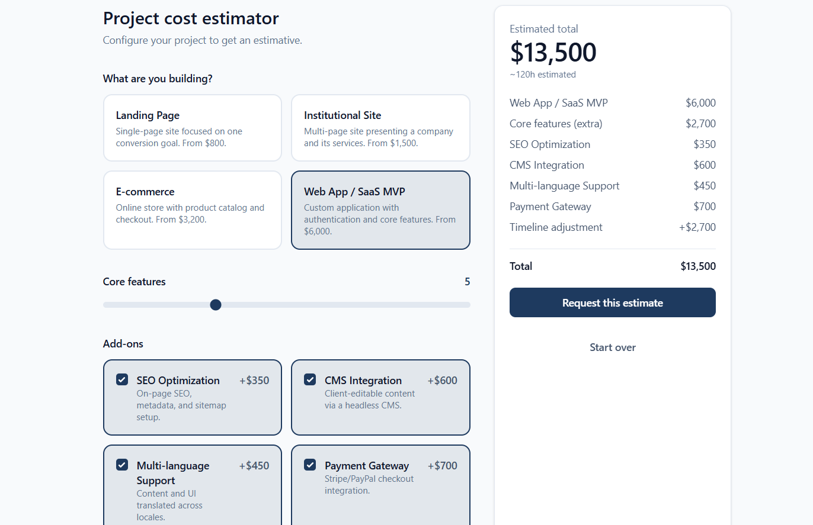

# Project Cost Estimator

An interactive calculator that provides instant website and app cost estimates. Built as a portfolio project and designed to be easily embedded into freelance or agency websites for lead qualification.



## Stack
- React + TypeScript + Vite
- Tailwind CSS v4
- Vitest + React Testing Library

## Technical Highlights

- Pricing rules are in `src/utils/calculatePrice.ts`.
- `usePricingCalculator` owns the calculator state while UI components remain presentational.
- Buttons, cards, radio cards, checkboxes, and sliders are reusable.
- Native `radio` and `checkbox` inputs provide keyboard and screen-reader support.
- Pricing data follows the `PricingConfig` interface, with mock data. Can be replaced by API integration.

## Run locally
```bash
npm install
npm run dev       # http://localhost:5173
npm run test      # Run tests
npm run build     # Production build
```

## Next steps
- Add conversion analytics with real data conversion API 
- Add Playwright E2E tests
- Support multiple currencies and languages